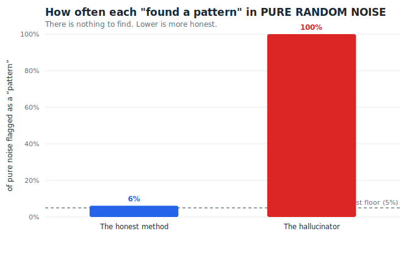
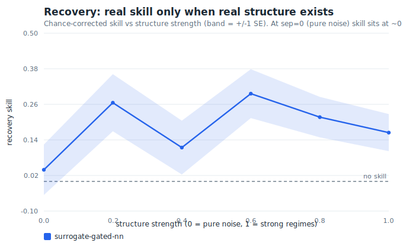
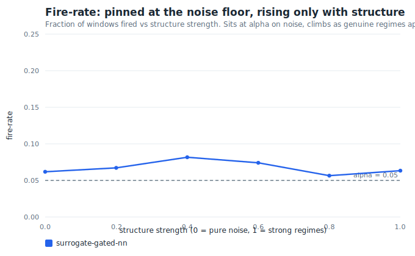

# planted

**A market that knows the right answer.**

`planted` is a benchmark for pattern-discovery methods on financial time series.
It generates synthetic markets with *planted* ground truth — and, crucially,
sometimes with **no structure at all** — then grades a method on two axes that
pull against each other:

- **Recovery** — when there *is* real structure, does the method find it?
- **Noise-rejection** — when there is **nothing to find**, does the method
  *admit it* and abstain, instead of hallucinating an "analog" anyway?

Most backtests only measure the first. That is how a method can look brilliant
and be fooling itself: on pure noise it still "discovers" patterns, and you never
notice because the noise was never labelled. `planted` labels the noise. A method
that screams *"analog!"* in a structureless world is caught and its score
collapses — no matter how good it looked on the structured worlds.

> The headline metric is **noise-rejection, not recovery.** Finding patterns is
> easy. Knowing when there are none is the hard, valuable part — and the part
> that survives contact with a real market.

Zero dependencies. Pure Python standard library. Runs anywhere.

---

## The one-line demo

```bash
python -m planted demo
```

```
planted :: demo — does the method know when to say 'nothing here'?

  surrogate-gated-nn   composite=0.201  recovery(structure)=0.219  fire-rate(noise)=0.054
  ungated-nn           composite=0.007  recovery(structure)=0.141  fire-rate(noise)=1.000

  The tourist (ungated) finds 'analogs' even in pure noise, so its
  composite collapses. Only abstaining on noise earns the score.
```

Two methods, same nearest-neighbour search. One adds a significance gate; one
doesn't. On structured worlds they look comparable. On **pure-noise** worlds the
ungated "tourist" fires on *100% of windows* — it cannot help itself — so its
headline composite collapses to ~0.



This is the whole thesis in one chart: **lower is honest.** The dashed line is
the honest floor (`alpha = 0.05`). A calibrated method sits on it. A method that
"finds something" everywhere sits at the top — and that is a liability, not a
feature.

---

## The leaderboard

```bash
python -m planted bench
```

```
  PLANTED LEADERBOARD  (higher composite = better)
  --------------------------------------------------------------------------
  method                composite  noise rec.  noise fire  struct rec.
  (want)                     high          ~0      ~alpha         high
  --------------------------------------------------------------------------
  surrogate-gated-nn        0.205       0.039       0.055        0.226
  ungated-nn                0.007       0.001       1.000        0.148
  random                    0.000      -0.073       0.065       -0.073
  --------------------------------------------------------------------------
```

Read across the **ungated-nn** row: its `struct rec.` (0.148) looks like real
skill — but its `noise fire` is `1.000`. It fires on everything, so its apparent
recovery is just the half of a broken clock that happens to be right. The
composite nets the two and the tourist drops to ~0. **random** is the floor: an
honest-but-useless control that recovers nothing and correctly fires at ~`alpha`.

---

## How a calibrated method behaves

Sweep the structure dial from `sep = 0` (pure noise) to `sep = 1` (strong
regimes) and watch a properly-gated method:

**Recovery rises only when real structure exists** — and sits at ~0 on noise, so
it never claims skill it doesn't have:



**Fire-rate stays pinned at the noise floor** until genuine regimes appear:



Those two curves *are* the definition of a trustworthy discovery method: it does
nothing on nothing, and more as there is more to do.

---

## How it works

Three pieces, each a small, readable module:

**1. Worlds with ground truth** (`planted/worlds.py`).
Returns are generated from a regime-switching GARCH(1,1) process with Student-t
(fat-tailed) innovations and a sticky Markov chain of hidden regimes. The regime
labels are kept as ground truth. Every world — structured or null — must pass a
**stylized-facts validator** (fat tails, volatility clustering, ~zero return
autocorrelation, leverage effect) so it actually looks like a market. A null
world is statistically a market with *no regime to find*: the trap.

**2. Methods** (`planted/methods.py`).
A *method* proposes "analogs" — pairs of historical windows it believes are the
same kind of market state — each with a p-value and a fired/abstained decision.
Three reference methods ship so you can see the spread:

| method | what it is |
| --- | --- |
| `RandomMatcher` | honest-but-useless control; fires at random rate `alpha`. The floor. |
| `UngatedNN` | the *tourist*: always calls its nearest neighbour an analog. Cannot abstain. |
| `SurrogateGatedNN` | the *practitioner*: a match only counts if it is closer than a structure-destroyed **surrogate** of the same series would produce. |

The gate is surrogate-data hypothesis testing: block-bootstrap the series to
destroy long-range regime structure while preserving its marginals and
short-range stylized facts, then keep a match only if it is anomalously close
relative to that null. That is what lets a method *abstain*.

**3. Scoring** (`planted/score.py`).
`recovery` is a chance-corrected skill score: among the matches a method *fired*,
how often do the two windows actually share a planted regime, above what random
pairing would give? `noise-rejection` penalizes firing above `alpha` on null
worlds. The headline `composite = recovery × noise-rejection` cannot be won by
finding analogs everywhere — only by finding real ones *and* abstaining on noise.

> **The chance baseline is conditioned on how the method is allowed to pair
> windows** (matches must be ≥ `min_gap` apart in time). Scoring against the
> naive unconditional baseline leaves a residual phantom "skill" in a random
> matcher — the benchmark fooling *itself*. `planted` corrects for this so an
> honest-but-useless method centers at exactly zero skill. See
> `score.expected_agreement`.

---

## Bring your own data

Real markets don't come with ground truth — but the method machinery runs on any
return series, and answers the one question that survives without labels:

> *Does this method find more structure in my series than in
> structure-destroyed copies of it?*

```bash
python -m planted explore yourdata.csv
```

```
  series length      : 2500 returns
  stylized facts     : kurtosis=+48.02  vol-cluster=+0.520  leverage=-0.122  marketlike=True
  method             : surrogate-gated-nn
  fire-rate (real)   : 0.274
  fire-rate (surrog) : 0.058 +/- 0.026
  z-score            : +8.28   (real vs structure-destroyed)
  surrogate p-value  : 0.048
  VERDICT            : evidence of real recurrence structure
```

CSV in, verdict out. The last column is used by default; pass `--col NAME|IDX` to
pick another and `--kind price|return` to override auto-detection (prices are
converted to log returns).

---

## Write your own method

Subclass `Method`, implement `match`, drop it into the benchmark. The full
example is in [`examples/custom_method.py`](examples/custom_method.py) — a custom
window representation in ~20 lines:

```python
from planted import run_benchmark
from planted.methods import SurrogateGatedNN

class MyMethod(SurrogateGatedNN):
    name = "my-method"
    # ...swap in your own window features / representation...

card = run_benchmark(MyMethod(), n_seeds=8)["scorecard"]
print(card["composite"], card["noise_recovery"], card["struct_recovery"])
```

Change the representation, re-run, and read a real, ground-truthed result —
including whether your clever new feature just made the method hallucinate more.

---

## The benchmark grades itself

The most important tests in this repo are the **null-sanity checks**
([`tests/test_null_sanity.py`](tests/test_null_sanity.py)): they assert that on
pure noise an honest method's recovery is statistically consistent with **zero**,
that the tourist hallucinates in that same noise, and that real structure is
genuinely recovered. They are what make `planted` *falsifiable* — if the
framework were fooling itself, they would fail.

```bash
python -m unittest discover -s tests
```

Pure stdlib `unittest`, no install required.

---

## Install

```bash
pip install planted          # once published
# or, from source:
git clone https://github.com/timgordontg/planted && cd planted
python -m planted demo
```

No dependencies. Python 3.9+.

---

## Why this exists

A backtest that only rewards finding patterns will always be gamed by a method
that finds patterns in everything. The discipline that separates a real edge from
an overfit story is **knowing when to abstain** — and you can only measure that
if you build worlds where the right answer is *"there's nothing here."*
`planted` builds those worlds, labels them, and scores honesty as a first-class
metric.

## License

MIT © Tim Gordon
